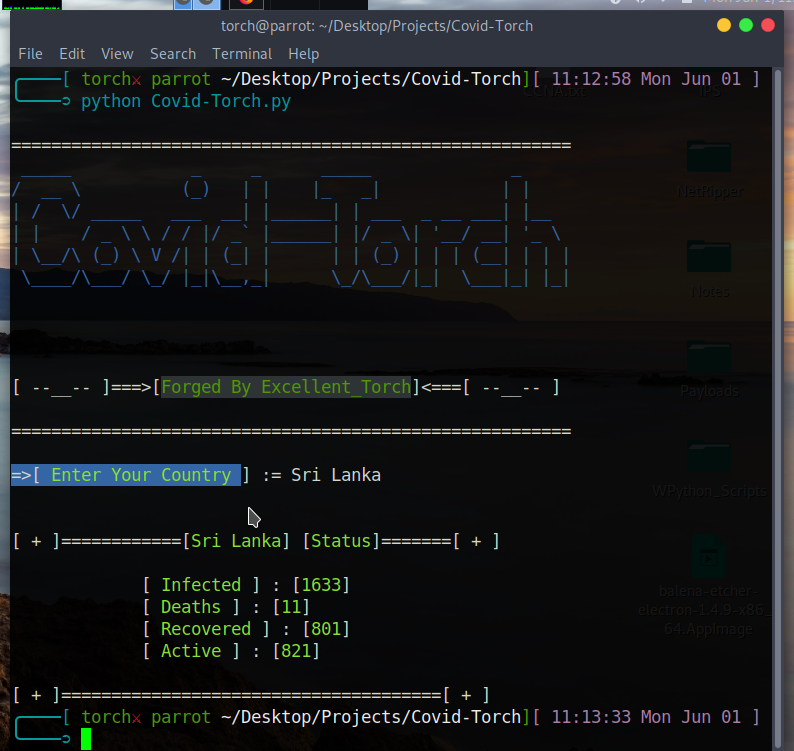

# Covid-Torch
Simple python script to show the results of current Covid-19 stats.

## Installation
Type these commands below in the terminal to setup the requirements.
```
apt install python2
pip install --upgrade pip
git clone https://github.com/Excellent-Torch/Covid-Torch.git
cd /[Directory_Name]/Covid-Torch
pip install -r requirements.txt

```
**Just _run_ the below command to launch the python script.**
```
python Covid-Torch.py
or
python2 Covid-Torch.py

```

